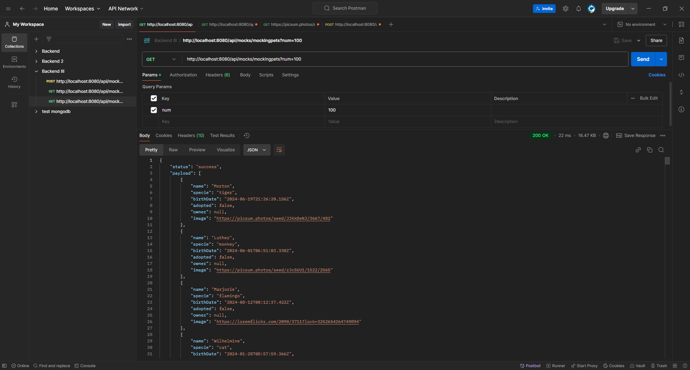
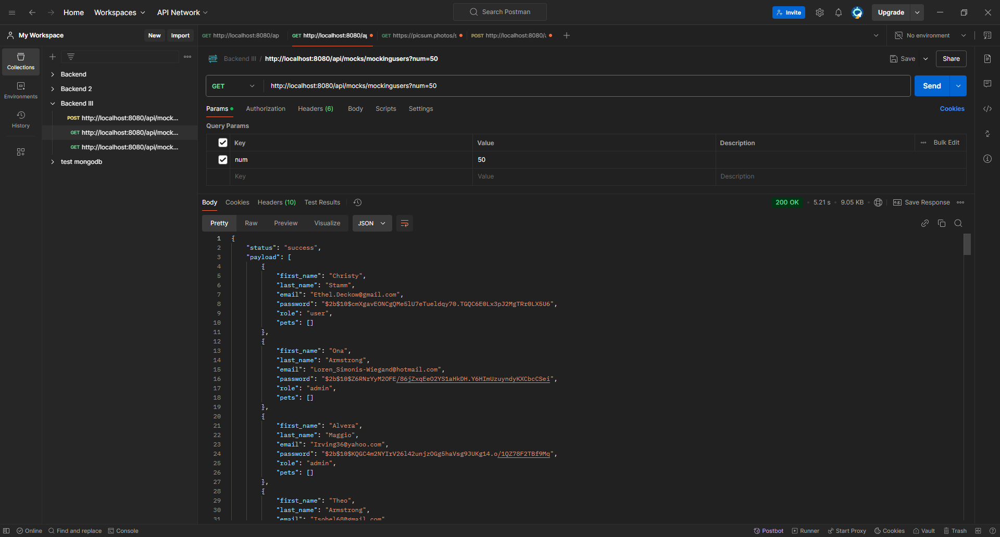
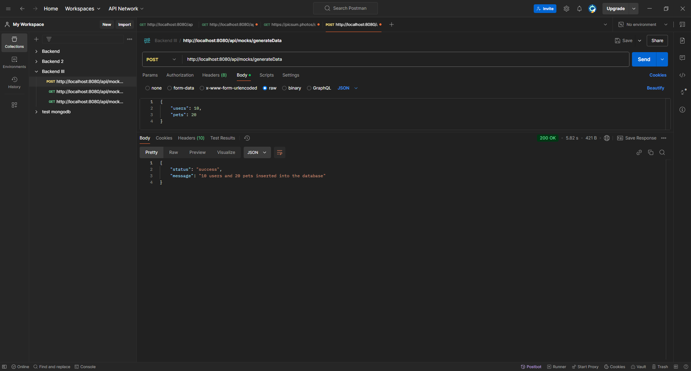
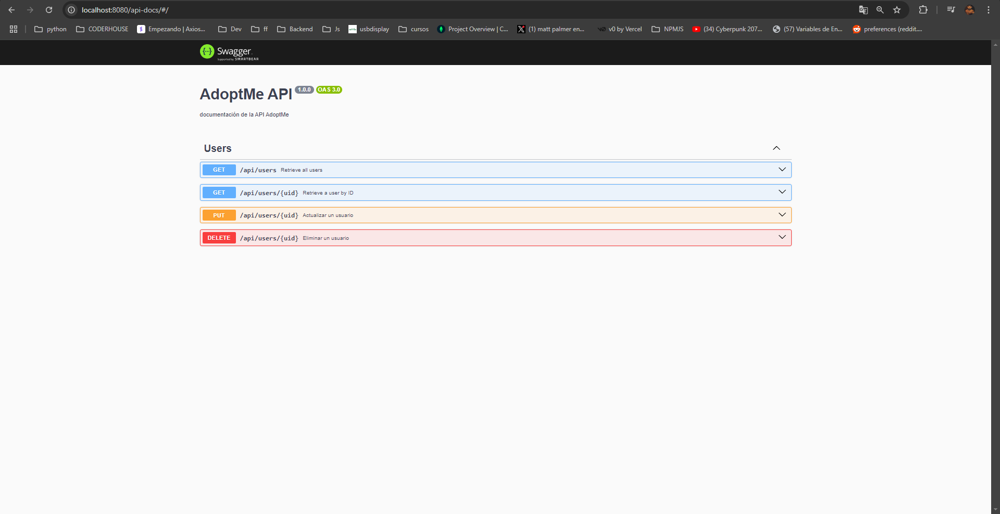
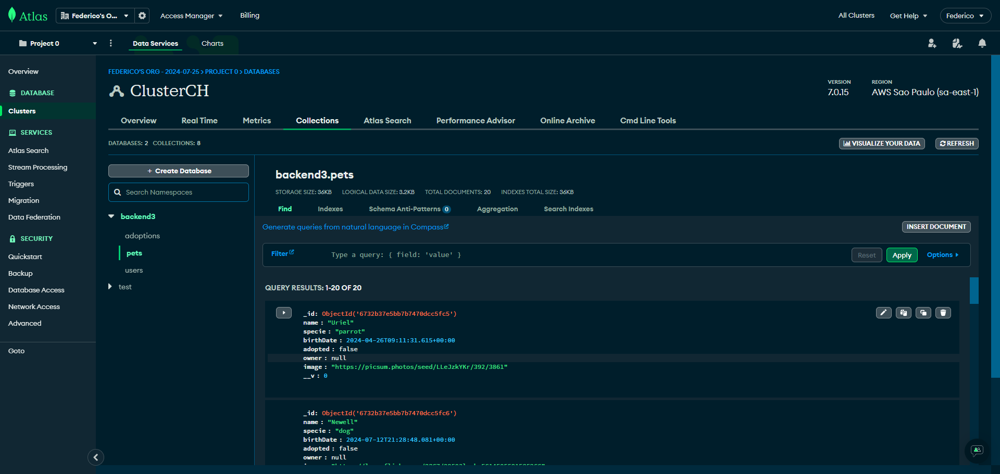
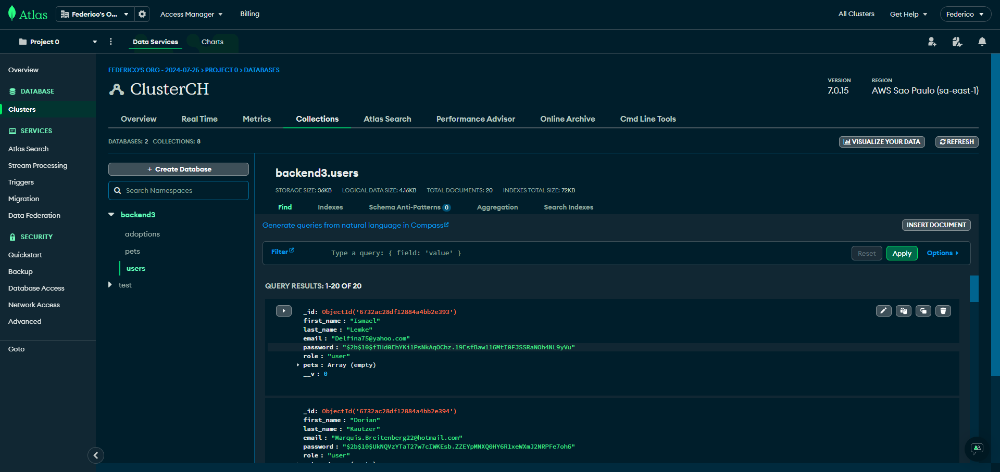
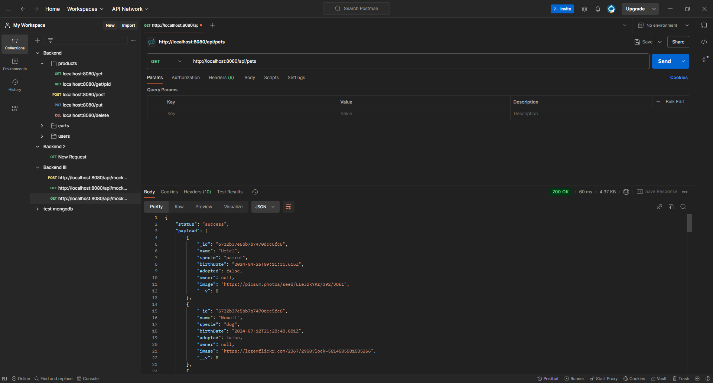
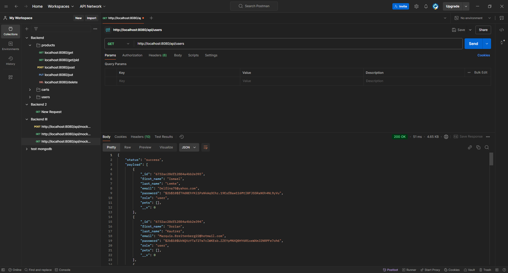

# RecursosBackEnd-Adoptme

## **Entrega Final Backend3:**

# **Imágen DockerHUB**

- URL Imágen Docker: https://hub.docker.com/r/fdnaranjo/recursosbackend-adoptme

    - Clonar imágen: 
            ```bash
            docker pull fdnaranjo/recursosbackend-adoptme
            ```
  
### **Implementaciones (Versión 1.0)**

- Crear un router llamado `mocks.router.js` que funcione bajo la ruta base `/api/mocks`.

- Mover el endpoint `/mockingpets` (Desarrollado en el primer Desafío Entregable) dentro de este router.

- Crear un módulo de Mocking para generar usuarios de acuerdo a un parámetro numérico. Dichos usuarios generados deberán tener las siguientes características:
  - En “password” debe tener la contraseña `coder123` encriptada.
  - “role” puede variar entre `user` y `admin`.
  - “pets” debe ir como array vacío.

- Dentro del router `mocks.router.js`, utilizar este módulo en un endpoint `GET` llamado `/mockingusers`, y generar 50 usuarios con el mismo formato que entregaría una petición de Mongo.

- Dentro del router `mocks.router.js`, desarrollar un endpoint `POST` llamado `/generateData` que reciba los parámetros numéricos `users` y `pets` para generar e insertar en la base de datos la cantidad de registros indicados.

### **Nuevas Implementaciones (Versión 1.2)**

- Documentar con Swagger los endpoints del módulo `users` (`users.router.js`) para `/api/users`.

- Implementar tests funcionales para todos los endpoints del router `adoption.router.js`.

- Agregar endpoint `POST /api/users` para crear nuevos usuarios según los requerimientos del modelo:
  - `first_name` (string, requerido)
  - `last_name` (string, requerido)
  - `email` (string, requerido, único)
  - `password` (string, requerido, encriptado antes de guardarse)
  - `role` (string, opcional, por defecto `user`)
  - `pets` (array vacío por defecto)

---

## **Para ejecutar:**

1. Instalar dependencias:
    ```bash
    npm install
    ```

2. Ejecutar el servidor:
    ```bash
    npm start
    ```

---

## **Para verificar el funcionamiento:**

### **Postman**

- **Para generar mascotas simuladas:**

    ```http
    GET http://localhost:8080/api/mocks/mockingpets?num=100
    ```

    

- **Para generar usuarios simulados:**

    ```http
    GET http://localhost:8080/api/mocks/mockingusers?num=50
    ```

    

- **Para insertar datos simulados en la base de datos:**

    ```http
    POST http://localhost:8080/api/mocks/generateData
    ```

    **Cuerpo de la solicitud (Body):**
    ```json
    {
        "users": 10,
        "pets": 20
    }
    ```

    

---

### **Swagger**

- Para ver la documentación de los endpoints `users`, abrir en el navegador:

    ```http
    http://localhost:8080/api-docs
    ```

    

---

### **MongoDB**

- **20 mascotas creadas:**

    

- **10 usuarios creados:**

    

---

## **Para testing:**

### **Tests funcionales**

1. Ejecutar los tests:
    ```bash
    npm test
    ```

2. Pruebas incluidas:
    - **Router `adoption.router.js`**:
        - `GET /api/adoptions`: Devuelve todas las adopciones.
        - `GET /api/adoptions/{aid}`: Devuelve una adopción específica.
        - `POST /api/adoptions/{uid}/{pid}`: Crea una adopción.
    - **Router `users.router.js`**:
        - `POST /api/users`: Crea un nuevo usuario.

---

## **Herramientas Utilizadas:**

- **Node.js**: v16.x
- **Express**: v4.x
- **Mongoose**: v6.x
- **Swagger-UI**: v4.x
- **Mocha**: v10.x
- **Chai**: v4.x
- **Supertest**: v6.x
- **Bcrypt**: v5.x
- **dotenv-flow**: v4.x
- **Postman**: v10.x (para pruebas manuales)
- **MongoDB Atlas**: Cloud Database

---

## **Capturas de pantalla adicionales:**

### **Postman (Verificar usuarios y mascotas)**

- **Mascotas:**

    

- **Usuarios:**

    